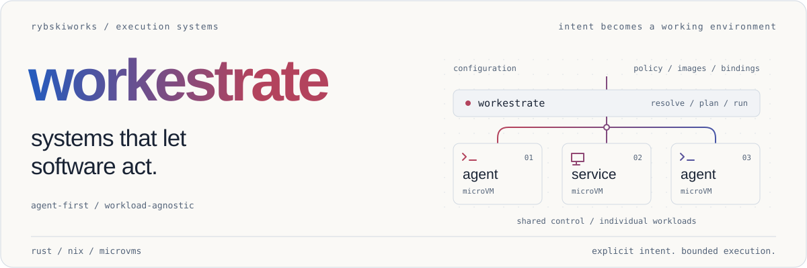
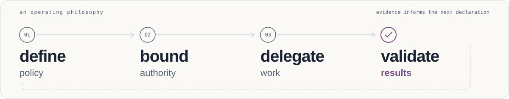

<a id="workestrate"></a>

<a href="https://github.com/rybskiworks">
  <picture>
    <source media="(prefers-color-scheme: dark)" srcset="docs/assets/workestrate-dark.svg">
    
  </picture>
</a>

<p align="center">
  <a href="#take-a-look">get started</a> /
  <a href="docs/README.md">documentation</a> /
  <a href="README.agents.md">architecture for agents</a> /
  <a href="https://github.com/rybskiworks/workestrate/issues">open work</a>
</p>

**Give software a place to work, and an explicit boundary to work within.**
Workestrate is a Rust CLI and Nix flake for running declaratively configured
agents and services in Microsandbox microVMs. Workloads, network policy, mounts,
and credential bindings live in configuration, not in a particular agent's prompt.

<a id="positioning"></a>
<a id="one-control-plane-explicit-boundaries"></a>

## a runtime, not an agent

Bring the agent, service, or development workload that suits the job. Workestrate
handles configuration and lifecycle; your fleet owns the workload definitions
and image builds. No particular model, provider, or coding harness is required.

The foundation is deliberately small: **TOML for intent, Nix for reproducible
build inputs, microVMs for execution.** Networking defaults to deny. Secrets are
SOPS-encrypted, with explicit host-bound or guest-bound delivery. The current
runtime uses the pinned Microsandbox fork on x86_64 Linux, without Docker.

<a id="how-it-works-today"></a>

## from intent to execution

<picture>
  <source media="(prefers-color-scheme: dark)" srcset="docs/assets/operating-loop-dark.svg">
  
</picture>

Declare what a workload needs. Inspect the resolved plan. Run it within the
selected policy. Check what actually happened. A configuration setting describes
intent; runtime evidence establishes what was enforced.

<a id="setup"></a>
<a id="start-here"></a>

## take a look

With Git and Nix (flakes enabled) on x86_64 Linux:

```sh
git clone --branch main https://github.com/rybskiworks/workestrate.git
cd workestrate
nix build --no-update-lock-file .#workestrate

./result/bin/workestrate --help
WORKESTRATE_CONFIG_DIR="$PWD/config.reference" ./result/bin/workestrate validate-config
WORKESTRATE_CONFIG_DIR="$PWD/config.reference" ./result/bin/workestrate workload plan example-service
```

This inspects the **synthetic reference configuration**, not your personal fleet,
and does not launch a VM. It does not provision a tool home either; the
reference supports inspection only. Use `./result/bin/workestrate` until the
CLI is on your `PATH`. `main` is the integration branch; the former migration
line was integrated
in [PR #32](https://github.com/rybskiworks/workestrate/pull/32).
Actual VM execution additionally requires accessible `/dev/kvm` and host
provisioning. Start with the [setup guide](docs/getting-started.md) and
[Nix build guide](docs/nix-build.md).

<a id="install-the-tool"></a>

## install the tool

On x86_64 Linux with Nix (flakes enabled):

```sh
nix profile install github:rybskiworks/workestrate
workestrate --version
workestrate doctor
```

Inside a workestrate checkout, `./scripts/host-provision.sh` is the supported
wrapper (it runs `nix profile install .#workestrate` when the installed entry
is stale). `nix profile install` is the portable verb: Lix provides no
`profile add` subcommand.

<a id="provision-home-config"></a>

## provision your home and config

```sh
# Provision the tool home once per machine, with a config repo attached:
workestrate home init --config <your-config-repo-url> --name personal
# Second machine, provisioned from an existing home:
# workestrate home clone <src-home-or-git-url> [dest-dir]
# Explicit home for one invocation:
# workestrate --home <tool-home-path> home init

# Config names come from your fleet, not the tool:
workestrate --home <tool-home-path> config list
workestrate config list
workestrate context current
workestrate validate-config

# Pair --home (WHERE the registry lives) with --config (WHICH config to target):
workestrate --home <tool-home-path> secrets update --config personal
workestrate secrets init --config personal   # first bootstrap only; use update after
```

`--home <DIR>` selects the tool-home root (registry, overrides,
state/store). It does not select which config layers are active, and it does
not relocate backend runtime state (`MSB_HOME` stays separate). `--home`
without `--config` on a `secrets` command selects no target; always pair them.
Enable a project directory's local layer explicitly with
`workestrate config trust <dir>`; never trust arbitrary checkouts.

<a id="define-plan-run"></a>

## define, plan, run

Define workloads in fleet TOML, then inspect before running. Run workload
verbs from the intended project directory: `${CWD}` mounts and per-directory
slots resolve against the invocation directory.

```sh
workestrate validate-config
workestrate workload plan <name> --show-source
workestrate check
workestrate workload up <service>
workestrate workload logs <service>
workestrate workload exec <agent>
```

<a id="tear-down-safely"></a>

## tear down safely

Scoped teardown takes exactly one selector per invocation:

```sh
workestrate down --context <ctx>
```

Alternatives: `down --all`, `down --config-ref <branch>`, or the double-gated
`down --everything --everything --yes`. The instance/workload rung stays on
`workload <name> down [--instance <id> | --all-instances]`. The
[flag glossary](README.agents.md#flag-glossary) states what `--home`,
`--context`, `--config-ref`, and `down --context` each select.

<a id="config-repos-and-the-layering-model"></a>
<a id="secrets-workflow"></a>
<a id="a-small-cli-surface-for-a-larger-system"></a>

## bring your own fleet

A fleet is your collection of workload definitions and operator configuration.
Keep application choices, image flakes, and encrypted credentials there rather
than baking them into the orchestration tool. Services run detached; agents
attach interactively. Workload names come from your configuration.

The [workload guide](docs/workloads.md) explains standalone repositories and
fleet-local capsules. The [configuration reference](README.agents.md#configuration-model)
and [secrets workflow](README.agents.md#secrets-workflow) cover the next steps.
The bundled example names are placeholders, not ready-to-run applications.

<a id="one-toolchain-authority"></a>

Workestrate and its Microsandbox input share a pinned
[nix-tooling](https://github.com/rybskiworks/nix-tooling) supplier. See the
[dependency boundary](README.agents.md#the-dependency-boundary) for ownership
and the locked-toolchain check.

<a id="cli-surface"></a>
<a id="development-workflow"></a>
<a id="canonical-docs"></a>
<a id="build-with-us"></a>

## find your depth

| Looking for | Start here |
| :--- | :--- |
| Setup, CLI commands, and operating details | [Setup guide](docs/getting-started.md) / [technical reference](README.agents.md#cli-reference) |
| Architecture, ownership, and where a change belongs | [Agent-oriented README](README.agents.md) |
| Always-applicable working instructions | [AGENTS.md](AGENTS.md) |
| Specifications, decisions, and focused guides | [Documentation index](docs/README.md) |

`README.md` introduces the project to people. `README.agents.md` is an optional,
text-first architectural map, readable by humans too. `AGENTS.md` stays short
and supplies working instructions; it points agents to broader context when
their task needs it. A narrowly scoped worker can go straight to the relevant
code and applicable instructions.

For development, start with `just bootstrap` or `just shell`, and use
`just verify` for the repository gate. See [contributing](CONTRIBUTING.md) and the
[development reference](README.agents.md#development-workflow) for checks,
Beads, hooks, and contribution conventions.

<a id="runtime-status"></a>
<a id="security-is-a-contract-not-a-badge"></a>

## status, without the mythology

Workestrate is under active development. Repository checks validate the CLI,
configuration, and pinned package contracts, **not every property of a deployed
fleet**. Lifecycle readiness and cleanup, mount-policy enforcement, SSH custody,
and nested confinement require their own runtime evidence. In particular, a
nested guest booting does not prove that disabling nesting enforces a boundary.

See [runtime status](README.agents.md#runtime-status), the
[testing guide](docs/testing.md), and
[runtime provisioning](docs/runtime-provisioning.md) before relying on a property.
Use the [security reporting guidance](SECURITY.md) for vulnerabilities.

---

<sub>Part of <a href="https://github.com/rybskiworks">rybskiworks</a>. Explicit intent. Bounded execution. Evidence over assumption. Original material: <a href="LICENSE">Apache-2.0</a>. Copyright (c) 2026 Georg Rybski. <a href="LICENSING.md">License scope and historical grants</a>; <a href="THIRD-PARTY.md">third-party exceptions</a>.</sub>
