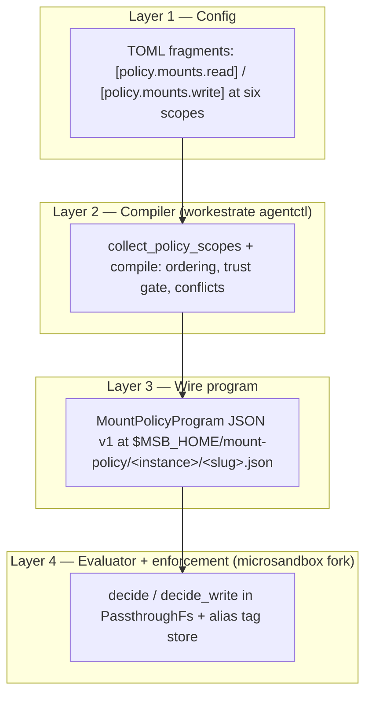

# Mount path policy — overview

> **What this doc teaches:** why mount path policy exists, the mental model in
> one box, the four-layer architecture, and where each concept lives in the
> two repos. **Read first.** No prerequisites.

## The problem

Workestrate sandboxes run untrusted agent code with host directories bind-mounted
into the guest — most importantly the project-root bind. A bind mount exposes
*everything* in that host directory to the guest: `.env`, `.git`, `~/.ssh`
material, PEM keys, tokens. A sandboxed agent that can read host secrets is a
secret-exfiltration channel.

The naive fix — staging a sanitized copy of the directory before mounting it —
does not survive contact with reality: agents and tools mutate the tree, the
copy goes stale, and two copies of a live project is a consistency bug farm.
What is needed is a way to make *selected paths inside the real mount*
invisible or untouchable, decided after boot, per mount, per workload. That is
the mount path-policy system (spec 22:
[../validation-and-improvements/06-improvements/22-dynamic-mount-masking-policy.md](../validation-and-improvements/06-improvements/22-dynamic-mount-masking-policy.md)).

> **30-second mental model**
>
> Every mount can carry a **policy**: glob rules about what the guest may
> **SEE** (the *read axis*) and what it may **TOUCH** (the *write axis*).
> You declare intent in TOML `[policy.mounts.read]` / `[policy.mounts.write]`
> fragments at several **scopes** (home registry → mount entry). One
> **compiler** folds all scopes into a single ordered **program** per mount.
> The runtime evaluates that program on every filesystem op.
> Three defaults to memorize: an **unmentioned** path is visible and writable;
> a **masked** path is *sealed, not deleted* (the host file is untouched); a
> **protected** path is an operator-only, untouchable seal that nothing can
> relax.

## The four layers

| Layer | Concrete artifact | Where |
|---|---|---|
| 1. Config | `[policy.mounts.*]` TOML fragments | workestrate `control/agentctl/src/mount_policy/scope.rs` |
| 2. Compiler | `compile()` → ordered rules + protect + writes | workestrate `control/agentctl/src/mount_policy/compile.rs` |
| 3. Wire program | `MountPolicyProgram` JSON v1 file, 0o600, atomic | written by workestrate `control/agentctl/src/microsandbox/policy_file.rs`; loaded by fork `crates/runtime/lib/vm.rs` |
| 4. Evaluator + enforcement | `MountPolicyProgram::decide` / `decide_write`, tag store, FUSE op handlers | fork `crates/filesystem/lib/backends/passthroughfs/unix/mount_policy/` and sibling op files |

## Repo map

Two repos implement the system:

| Repo | Path | Branch | Owns |
|---|---|---|---|
| workestrate (the tool) | `/home/node/Development/agent-workbench/workestrate` | `migration/tool-model` | config surface, scopes, compiler, trust gate, policy-file writer, CLI (`policy mounts explain` / `preview`) |
| microsandbox fork | `/home/node/Development/agent-workbench/microsandbox-mount-policy` | `develop` | wire loader (fail-closed), evaluator, tag store, FUSE enforcement |

Workestrate pins the fork by git rev in `flake.nix` and applies one transient
nix patch (`nix/patches/mount-policy-approved-root.patch`); see
[04-compiler-and-wire.md](./04-compiler-and-wire.md) for what that patch does.

## Reading order

| Doc | You'll learn |
|---|---|
| [01-runtime-semantics.md](./01-runtime-semantics.md) | What the guest actually observes per operation; the tag store; the adoption caveat; known gaps. The heart. |
| [02-config-surface.md](./02-config-surface.md) | The TOML vocabulary: read/write axes, `final`, pattern dialect, mount-row sugar, migration from the old words. |
| [03-hierarchy-and-precedence.md](./03-hierarchy-and-precedence.md) | The six scopes, authority order, last-non-frozen-match-wins, the trust gate, worked examples. |
| [04-compiler-and-wire.md](./04-compiler-and-wire.md) | The pipeline from TOML to a loaded immutable program; the wire format; the approved-root story. |
| [05-cookbook.md](./05-cookbook.md) | Copy-paste recipes with expected guest-visible behavior and caveats. |
| [06-testing.md](./06-testing.md) | How to verify: unit gates, the smoke check, the host e2e, and how to decode failures. |

Adjacent references: [ADR 0029 (collect-and-compile)](../migration/50-decisions/0029-policy-scopes-collect-and-compile.md),
[ADR 0030 (instance lifecycle and port bands)](../migration/50-decisions/0030-instance-lifecycle-and-namespacing.md),
[ADR 0031 (config surface)](../migration/50-decisions/0031-mount-path-policy-config-surface.md),
and the [operator guide](../validation-and-improvements/mount-masking-operator-guide.md).
