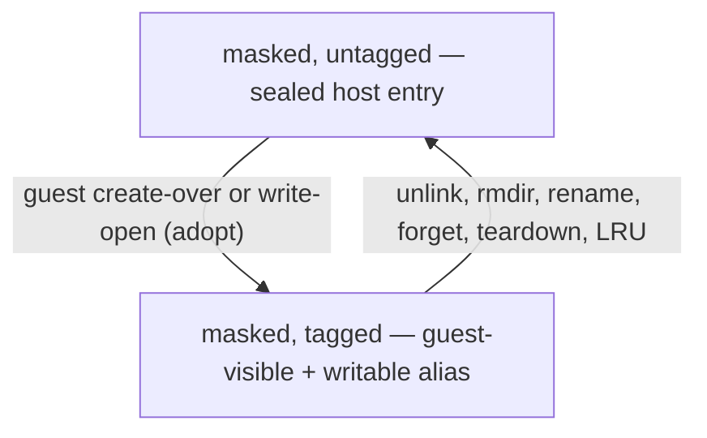

# Runtime semantics — what the guest actually observes

> **What this doc teaches:** the read-axis decisions, the write-axis decision,
> the per-event truth table, the alias tag store, the adoption caveat, and the
> known gaps. **Read first:** [00-overview.md](./00-overview.md). Config
> syntax is in [02-config-surface.md](./02-config-surface.md); you do not need
> it to follow this doc.
>
> Every behavioral claim below cites its evidence inline as `(source: path:lines)`.
> Fork paths are relative to `/home/node/Development/agent-workbench/microsandbox-mount-policy`
> (branch `develop` @ `34a32d68`); tool paths are relative to the workestrate repo.
> `program.rs` below means the fork's
> `crates/filesystem/lib/backends/passthroughfs/unix/mount_policy/program.rs`;
> `test_mount_policy.rs` / `test_mutation_policy.rs` mean the fork's
> `crates/filesystem/lib/backends/passthroughfs/unix/tests/` files.

## Terms, defined before use

- **Decision (read axis):** the evaluator's answer to "what may the guest see
  at this path?" — one of `Visible`, `Masked`, `TraversalOnly`
  (source: program.rs:18-27).
- **Write decision (write axis):** the answer to "may the guest write here?" —
  `Allow` or `Deny`.
- **Rule:** one compiled pattern with an effect (`Mask`/`Unmask`), an
  `overridable` flag (wire name for "not final"), and an origin. A rule with
  `overridable: false` is **terminal**: it freezes the decision for that path.
- **Protect bucket:** a separate list of terminal Mask rules that short-circuit
  everything. Only operator-scope final `read.deny` entries land here (compile
  routing in workestrate `control/agentctl/src/mount_policy/compile.rs:198-216`).
- **Alias tag:** a runtime record that the guest created (or adopted) a file at
  a masked name — making that one name visible and writable to the guest. See
  "The tag store" below.
- **Tagged / untagged:** whether an alias tag currently exists for that
  (parent, name) pair.

## The read axis (visibility)

Order of evaluation (source: program.rs:171-243):

1. Non-UTF-8 path → `Masked`, fail-closed (source: program.rs:172-179; test
   test_mount_policy.rs:167-179).
2. Any protect-bucket rule matches → `Masked` immediately, before `rules` run
   (source: program.rs:180-206).
3. Otherwise `rules` evaluate in program order; the **last non-frozen match
   wins**. A terminal rule (`overridable: false`) freezes the decision; later
   matching rules are still recorded in the explain trace but flagged
   `frozen_out` (source: program.rs:207-232).
4. No rule matched → default `Visible` (source: program.rs:233). *Unmentioned
   path = visible.*
5. A `Masked` directory that may contain an unmaskable descendant is upgraded
   to `TraversalOnly` by literal-prefix analysis (`may_unmask_descendant`);
   floating patterns like `**/x` conservatively return true (source:
   program.rs:234-236, 380-396; test test_mount_policy.rs:157-164).

`TraversalOnly` means: the directory IS listed in readdir so the guest can
walk through to the unmasked descendant, but its own masked children are
filtered (source: test test_mount_policy.rs:43-59; contrast with fully Masked
at :150-155).

## The write axis (write admission) — union semantics

On fork `develop` (commits `63c0dff0`, `808bcf45`; NOT in the pinned runtime —
see gap 5), write admission works as follows (source: program.rs:260-355):

1. Protect short-circuits to `Deny`; protect matches are recorded in the
   explain trace but write rules cannot change the decision (source:
   program.rs:269-295; test test_mount_policy.rs:371-391).
2. The union of `writes.allow` ∪ `writes.deny` evaluates authority-ascending
   (home-registry first … mount-entry last); WITHIN a scope, deny rules
   evaluate before allow rules; then by index within the bucket (source:
   program.rs:296-315).
3. Last non-frozen match wins: a later (lower-authority) scope relaxes an
   earlier scope's rule unless frozen (source: test_mount_policy.rs:312-326);
   within one scope an allow carves an exception out of a broader deny
   (source: test_mount_policy.rs:285-299).
4. Terminal freeze works both directions: a terminal deny cannot be allowed
   over (source: test_mount_policy.rs:329-351); a terminal allow cannot be
   denied over (source: test_mount_policy.rs:353-368).
5. No write rule matches → default `Allow` (source: program.rs:291-295; test
   test_mount_policy.rs:394-397; tool compile test compile.rs:654-684).
   *Unmentioned path = writable.*
6. Non-UTF-8 → `Deny`, fail-closed (source: test_mount_policy.rs:398-401).

## Per-event truth table

Rows are guest filesystem events; columns are the state of the path. All
citations are to the fork's `crates/filesystem/lib/backends/passthroughfs/unix/tests/`.

### Masked, untagged (a host file the guest never wrote)

| Event | Result | Source |
|---|---|---|
| lookup | `ENOENT` | test_mount_policy.rs:217-233 |
| readdir of parent | name omitted | test_mount_policy.rs:25-39 |
| read-open (`O_RDONLY`) | `ENOENT` | test_mutation_policy.rs:121-126 |
| create-over the masked name | ALLOWED; tags the alias | test_mutation_policy.rs:104-109 |
| write-open (`O_WRONLY`) the existing host file | ALLOWED; ADOPTS and tags the host file | test_mutation_policy.rs:112-118 |
| unlink | `ENOENT`; host file untouched | test_mutation_policy.rs:129-138 |
| rmdir | `ENOENT` | test_mutation_policy.rs:153-162 |
| rename as source | `ENOENT` (anti-laundering); host file untouched | test_mutation_policy.rs:277-283 |

### Masked, tagged (guest created or adopted the name)

| Event | Result | Source |
|---|---|---|
| lookup / readdir / stat / read / write | all work — fully visible + writable | test_mutation_policy.rs:104-118 |
| unlink | succeeds, deletes the host file, evicts the tag; a fresh host file at that name is masked again | test_mutation_policy.rs:141-150 |
| rename as source | allowed; tag invalidated, NOT moved | test_mutation_policy.rs:286-294 |
| rename-overwrite | invalidates the TARGET's tag | test_mutation_policy.rs:297-306 |
| rename-exchange of identical identity | evicts both tags | test_mutation_policy.rs:309-337 |
| host-side replace of the file | tag invalidated on identity revalidation | test_mutation_policy.rs:519-525 |

### Visible + write-denied

| Event | Result | Source |
|---|---|---|
| create | `EACCES`; no host file created | test_mutation_policy.rs:359-368 |
| unlink | `EACCES` | test_mutation_policy.rs:371-380 |
| rmdir | `EACCES` | test_mutation_policy.rs:383-392 |
| open `O_WRONLY`/`O_RDWR` | `EACCES`; `O_RDONLY` fine | test_mutation_policy.rs:432-439 |
| write | `EACCES` | test_mutation_policy.rs:442-451 |
| fallocate / setattr / ftruncate / copy_file_range | `EACCES` | test_mutation_policy.rs:528-590 |
| reads | fine | test_mutation_policy.rs:463-470 |

### Masked AND write-denied (both match)

| State | Remove-class ops | Source |
|---|---|---|
| Masked, untagged | `ENOENT` — INVISIBILITY takes precedence over write-deny on remove-class | test_mutation_policy.rs:395-404; enforcement remove_ops.rs:814-817 |
| Masked, tagged | `EACCES` | test_mutation_policy.rs:407-429 |

### Protected (protect bucket)

| Event | Result | Source |
|---|---|---|
| lookup | `ENOENT` | test_mutation_policy.rs:340-356 |
| readdir | omitted | test_mutation_policy.rs:340-356 |
| create-over | `EACCES` | test_mutation_policy.rs:340-356 |
| write-open | `EACCES` | test_mutation_policy.rs:340-356 |
| unlink | `ENOENT` | test_mutation_policy.rs:340-356 |
| rename as source or destination | `ENOENT` | test_mutation_policy.rs:340-356 |
| tagging | never tagged | test_mutation_policy.rs:340-356 |
| protected entry inside a masked dir | BLOCKS cascade removal of the ancestor (`ENOTEMPTY`, no name leak) | test_mutation_policy.rs:194-203 |

### Cascade delete

- rmdir of an untagged masked dir whose descendants are all masked: removes
  the untagged-masked descendants only, then the dir (source:
  test_mutation_policy.rs:165-191).
- Any tagged, protected, or visible leftover → `ENOTEMPTY`, fail-closed, no
  data loss (source: test_mutation_policy.rs:194-229).
- Cascade evicts descendant tags (source: test_mutation_policy.rs:257-274).

### No policy at all

Byte-identical behavior to the unpatched backend (source:
test_mount_policy.rs:77-94; test_mutation_policy.rs:498-516).

## The tag store

The alias tag store is how a masked name can become guest-visible without ever
exposing the original host content (source: fork
`crates/filesystem/lib/backends/passthroughfs/unix/tag_store.rs`):

- **Keyed by (parent synthetic inode, name bytes)** — alias-scoped, not
  path-string-scoped (source: tag_store.rs:27).
- **Value pins the host inode** via a duplicated `O_PATH` fd and records the
  identity (`InodeAltKey`); lookup revalidates identity before honoring a tag
  (source: tag_store.rs:29-35, 81-113; revalidation behavior at
  test_mutation_policy.rs:519-525).
- **Bounded LRU, 10,000 entries**; eviction is counted (the `exhausted`
  counter) (source: tag_store.rs:20, 104-113, 137-140).
- **Eviction paths:** unlink/rmdir of the alias; rename (invalidates, never
  moves); rename-overwrite (target's tag); parent-inode forget
  (`evict_parent`, tag_store.rs:121-134); mount teardown (`clear`,
  tag_store.rs:143-145); LRU pressure.
- **Every eviction fails safe:** a lost tag RE-MASKS the name; it never
  exposes anything.
- **Tags are volatile:** a sandbox restart loses all tags → everything
  remasks.

## The adoption caveat (mask = passive seal)

A mask alone is a **passive seal, not immutability**. Write-opening
(`O_WRONLY`/`O_RDWR`/`O_CREAT`) a masked host file ADOPTS and tags it (source:
test_mutation_policy.rs:112-118), and create-over a masked name tags the
guest's new file (source: test_mutation_policy.rs:104-109). After adoption the
name is fully guest-writable. To make a path genuinely untouchable you need
the **protect tier**: an operator-scope final `read.deny` (see
[03-hierarchy-and-precedence.md](./03-hierarchy-and-precedence.md)).

## Protect bucket semantics

Protection is the short-circuit tier: any protect match masks the path before
`rules` run (source: program.rs:180-206) and forces write `Deny` regardless of
write rules (source: program.rs:269-295). Consequences, all cited in the truth
tables above: protected paths are never tagged; create/write attempts return
`EACCES` while remove-class and lookup return `ENOENT` (the errno split); and
a protected entry blocks cascade removal of an ancestor masked dir with
`ENOTEMPTY` — the cascade fails closed rather than leak or delete.

## Errno precedence

- **Invisibility beats write-deny on remove-class ops:** masked-untagged +
  write-denied → `ENOENT`, not `EACCES` (source: test_mutation_policy.rs:395-404;
  remove_ops.rs:814-817).
- **Tagged + write-denied → `EACCES`** (source: test_mutation_policy.rs:407-429):
  once the name is tagged it is visible, so the write gate answers instead.

## Defaults and fail-closed edges

- Unmentioned path: read `Visible`, write `Allow` (sources above).
- No policy at all: byte-identical to the unpatched backend (sources above).
- Non-UTF-8 path: `Masked` on read, `Deny` on write (sources above).

## Known gaps

Verified gaps in the CURRENT enforcement. Each is real, located, and not yet
fixed; do not design policy that depends on them being closed.

1. **Dir-only patterns parsed but not enforced.** The evaluators match via
   `matches_unknown` (source: program.rs:184, 202, 211, 273, 317, 361), which
   ignores `dir_only` (source: fork mount_policy/pattern.rs:166-169); the
   dir-aware matchers `matches_path`/`matches_dir` (pattern.rs:157-164) are
   never called outside pattern.rs. Effect today: `.git/` also matches a FILE
   named `.git`.
2. **Rename-source write-deny unchecked.** `rename_admission` (source: fork
   remove_ops.rs:903-938) checks the source only for protect + masked-untagged
   visibility (:920-927) and checks write admission only on the DESTINATION
   (:928-936); `decide_write(src)` is never called. Effect: a visible
   write-denied file can be renamed OUT (the destination is still write-gated).
3. **getattr/access leak on held inodes.** `do_getattr` (source: fork
   metadata.rs:29-44) and `do_access` (metadata.rs:276-318) perform NO policy
   check; a guest holding an inode (cached before policy install, or an open
   handle) can still stat/access-probe a masked path. Metadata leak, not
   content. Contrast: `do_setattr` IS gated (metadata.rs:62-84).
4. **Mount-slug collision.** `mount_slug` (source: workestrate
   control/agentctl/src/microsandbox/policy_file.rs:77-79) maps guest `/a/b`
   and `/a_b` to the same slug `a_b`; two such mounts in one instance
   overwrite each other's policy file (last writer wins, source: workestrate
   control/agentctl/src/microsandbox/runtime/run.rs:581-593). Guest `/` yields
   an empty slug (policy_file.rs:75-76).
5. **`write.allow` inert at the pinned runtime.** Workestrate's flake pins
   fork rev `3bd051bf`, whose evaluator predates the union semantics — at that
   pin, write admission enforces `write.deny` + protect only. The union
   semantics described in "The write axis" above live on fork `develop`
   (commits `63c0dff0`/`808bcf45`, unpushed). The tool's mirror evaluator
   (source: workestrate control/agentctl/src/mount_policy/program.rs:303-400)
   INTENTIONALLY matches the pinned runtime: within a scope allow evaluates
   before deny so deny wins (:352-362), and an allow can never lift an
   already-matched deny (:385-392). Porting the mirror at re-pin is a recorded
   follow-up (handovers/2026-08-13-mount-merge-readiness.md §9o step 2; also
   flagged as the "Activation caveat" in the
   [operator guide](../validation-and-improvements/mount-masking-operator-guide.md)).

> **Historical note (2026-09-04):** gap 5 above records the evaluator at fork
> rev `3bd051bf` (`write.allow` inert, deny-wins mirror). The live
> `microsandbox-fork` pin is `78fb3ed1` (`flake.nix`:15-37), which carries the
> write.allow arm with union semantics natively, and the mirror already
> implements it (`control/agentctl/src/mount_policy/program.rs:304-317`).
> Full rewrite of gap 5 is a follow-up.

## Accepted trade-offs

Documented in spec 22 §16
([../validation-and-improvements/06-improvements/22-dynamic-mount-masking-policy.md](../validation-and-improvements/06-improvements/22-dynamic-mount-masking-policy.md)):

- **Hardlink name-vs-object masking:** a visible hardlink alias exposes the
  object; policy is per-name, not per-inode.
- **TraversalOnly getattr reveals dir metadata** (name-level, not content).
- **Quota counts masked bytes.**
- **~5s negative-dentry kernel cache delay** before a newly masked name
  disappears everywhere.
- **Blind-write clobber accepted:** mounting a directory implies accepting
  write risk to it.
- **Tag-cap exhaustion fails safe** (re-masks).
- **Restart remasks** everything (tags are volatile).
- **readlink target strings are visible** (name-level leak).
- **v1 limitation:** mount-entry policy comes only from the DECLARING layer of
  the mount row (source: workestrate control/agentctl/src/mount_policy/scope.rs:30-32;
  spec 22 §8.3).
