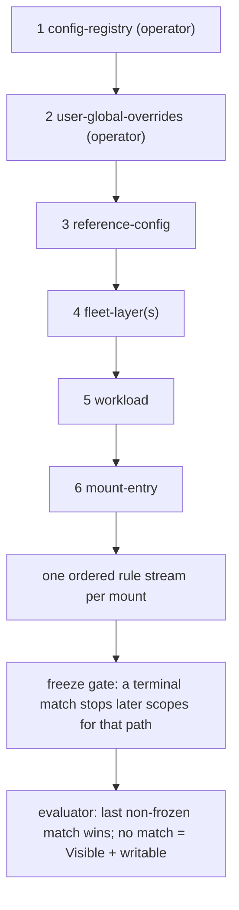

# Hierarchy and precedence — how six scopes become one program

> **What this doc teaches:** the six declaration scopes, how their rules are
> ordered, what "last non-frozen match wins" means in practice, the one trust
> rule, and the duplicate-conflict rule — with a fully worked example.
> **Read first:** [02-config-surface.md](./02-config-surface.md) for the
> vocabulary; [01-runtime-semantics.md](./01-runtime-semantics.md) for what
> the decisions mean at runtime.

## The six scopes, in authority order

Policy fragments are **collected per scope, never merged** (ADR
[0029](../migration/50-decisions/0029-policy-scopes-collect-and-compile.md));
the compiler owns all precedence. Authority order IS compile order — the enum
order of `ScopeKind` (workestrate
`control/agentctl/src/mount_policy/scope.rs:19-33`; `authority()` is the enum
ordinal, scope.rs:38-40; the sort is stable so same-kind scopes keep stack
order, compile.rs:147-149):

| # | Scope (`scope_kind`) | Where declared | Band |
|---|---|---|---|
| 1 | `config-registry` | home `config.toml` `[policy.mounts]` | **operator** |
| 2 | `user-global-overrides` | `overrides.toml` `[policy.mounts]` | **operator** |
| 3 | `reference-config` | `config.reference/workestrate.toml` | shipped defaults |
| 4 | `fleet-layer` | a fleet layer's `[policy.mounts]` (registry stack order) | fleet |
| 5 | `workload` | `[workloads.<name>.policy.mounts]` | workload |
| 6 | `mount-entry` | a `[[workloads.<name>.mounts]]` row's `policy` table or `read.*`/`write.*` sugar | workload |

Only scopes 1–2 are **operator scopes** (scope.rs:46-51). Scope 6 comes only
from the DECLARING layer of the mount row (scope.rs:30-32; v1 limitation,
spec 22 §8.3).

## Emission order

- Scopes emit in authority order (1 → 6).
- Within a scope, the read axis emits `deny` rules before `allow` rules
  (compile.rs:205-217); protect-bucket entries land in the same
  scope/authority order.
- The write axis stores `allow` and `deny` in two buckets; at evaluation the
  union is re-ordered authority-ascending, deny-before-allow within a scope
  (see [01-runtime-semantics.md](./01-runtime-semantics.md#the-write-axis-write-admission--union-semantics)).

The resulting model: **one ordered rule stream per mount**, evaluated in
order, where the LAST matching rule that is not frozen out decides.



## Precedence rules, precisely

1. **Last non-frozen match wins.** Later scopes relax earlier scopes — a
   fleet `read.allow` can re-expose what the reference config denied.
2. **A final (terminal) match freezes per-path.** Later rules that match the
   same path are recorded in the `explain` trace with `frozen_out: true` but
   cannot change the decision. The `frozen_by` field names the terminal rule's
   origin.
3. **Within one scope, deny is emitted before allow.** For relaxable
   duplicates (same pattern denied and allowed in ONE scope, neither final)
   this ordering resolves the conflict silently: on the read axis the allow
   wins (test compile.rs:573-585); on the write axis the deny wins (test
   compile.rs:908-928). Neither is an error — but do not rely on it; see rule 5.
4. **The trust gate.** A final ALLOW on either axis (`read.allow` or
   `write.allow` with `final = true`) from a NON-operator scope is a compile
   error (`FinalAllowFromNonOperator`, naming origin, pattern, and axis;
   compile.rs:237-250; tests compile.rs:472-506 and :774-811). Final DENIES
   are accepted from ANY scope — denying is the fail-closed direction (tests
   compile.rs:509-533, :832-855). This is the whole trust model: an untrusted
   repo layer can never permanently reopen a path; it can only permanently
   close one.
5. **Duplicate conflict.** The same raw pattern appearing as both deny and
   allow within ONE scope, with at least one entry final, is a compile error
   naming BOTH origins — on both axes, and the read-axis check includes
   protect-routed denies (compile.rs:252-298; tests compile.rs:554-570,
   :861-905). The same pattern denied in one scope and allowed in ANOTHER is
   not an error; it is ordinary precedence (test compile.rs:588-606).
6. **Protect routing.** An operator scope's final `read.deny` compiles to the
   `protect` wire bucket (terminal, masked AND write-denied, short-circuiting);
   a non-operator scope's final `read.deny` is legal but compiles to an
   ordinary terminal Mask rule — a visibility-only freeze whose target is
   still adoptable/taggable at runtime (compile.rs:198-216; tests
   compile.rs:690-771). See the adoption caveat in
   [01-runtime-semantics.md](./01-runtime-semantics.md#the-adoption-caveat-mask--passive-seal).

## Worked example

Four scopes declare rules that interact on three paths:

```toml
# reference-config (scope 3) — ships non-final sensitive defaults
[policy.mounts.read]
deny = ["**/.env"]
```

```toml
# fleet-layer (scope 4) — re-expose the example file
[policy.mounts.read]
allow = ["**/.env.example"]
```

```toml
# workload (scope 5) — freeze a visible-but-untouchable tree
[workloads.api.policy.mounts.write]
deny = [{ pattern = "secrets/**", final = true }]
```

```toml
# config-registry (scope 1, operator) — pin a generated-code tree open against
# every later layer.
[policy.mounts.read]
allow = [{ pattern = "gen/**", final = true }]
```

### Path `.env`

Read-axis matches in program order: rule from scope 3 (`deny "**/.env"`,
non-final). Scope 4's allow `"**/.env.example"` does NOT match `.env` (the
glob is exact about the suffix). Result: last non-frozen match = scope-3 deny
→ **Masked**. Nothing final matched, so a later scope could still relax it —
but no later rule matches this path.

### Path `.env.example`

Matches, in order: scope-3 `deny "**/.env"` (does NOT match — `.env` does not
glob-match `.env.example`); scope-4 `allow "**/.env.example"` matches →
**Visible**. The repo carve-out wins by ordering (last non-frozen match), not
by any special "allow beats deny" rule.

### Path `secrets/key.pem`

Write axis: scope-5 final `write.deny "secrets/**"` matches and freezes →
**write Deny**, frozen. Any write rule from scope 6 (mount-entry) matching
this path would be recorded `frozen_out: true` in the `explain` trace and
ignored. Read axis: no rule matches → **Visible**. Net effect: the guest can
read `secrets/key.pem` but every write-class op returns `EACCES` — the
"visible but untouchable" posture.

### Path `gen/output.rs`

Read axis: operator scope-1 final `read.allow "gen/**"` matches → **Visible**,
frozen BY THE OPERATOR. A scope-3..6 `read.deny` matching `gen/**` would be
`frozen_out`. This is why final allows are operator-only: only the operator
may pin a path open against every later layer. (Had a repo scope tried to
declare that final allow, compilation would fail with
`FinalAllowFromNonOperator`.)

### Contrast: what a final read.deny does in each band

| Declaring scope | `deny = [{ pattern = "x/**", final = true }]` compiles to | Runtime effect |
|---|---|---|
| operator (1–2) | protect bucket | hidden, write-denied, untaggable, short-circuiting |
| non-operator (3–6) | terminal Mask rule in `rules` | visibility frozen; still adoptable if the guest write-opens the name |

## Ship defaults context

The reference config (scope 3) ships non-final `read.deny` defaults only —
`**/.env`, `**/.env.*`, `**/.ssh/**`, `**/*.pem`, `**/*.key`, `**/.git/**`,
`**/.sops.yaml`, `**/node_modules/.npmrc`
(config.reference/workestrate.toml:24-34). Everything is non-final so any repo
or workload layer can carve exceptions with `read.allow`; the reference config
intentionally declares nothing final and nothing protected — protection is an
operator-only tier.
