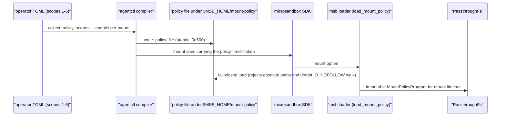

# Compiler and wire — how a fragment becomes a loaded program

> **What this doc teaches:** the step-by-step pipeline from TOML fragment to
> an immutable in-memory policy program inside the guest-serving filesystem,
> the wire format, the approved-root history, and the mirror-evaluator
> relationship. **Read first:**
> [03-hierarchy-and-precedence.md](./03-hierarchy-and-precedence.md). Runtime
> evaluation of the loaded program is
> [01-runtime-semantics.md](./01-runtime-semantics.md).
>
> Fork paths below are relative to
> `/home/node/Development/agent-workbench/microsandbox-mount-policy`; tool
> paths are relative to the workestrate repo.

## The pipeline, hop by hop

1. **Collection.** `collect_policy_scopes`
   (`control/agentctl/src/config/loading.rs:407`) walks the layer stack and
   collects one `PolicyScope` per declaring layer — global scopes shared by
   every workload, workload scopes keyed by name — stored process-global via
   `set_collected_policy` (loading.rs:394).
2. **Per-mount compile.** At workload construction, each mount compiles its
   OWN program from the global scopes + the workload's scopes + mount-entry
   scopes filtered to that mount's guest path
   (`control/agentctl/src/microsandbox/workload/config.rs:190-223`; mount-entry
   guest filter at :203-206). The compiler is
   `control/agentctl/src/mount_policy/compile.rs`: authority sort, per-scope
   deny-then-allow emission, protect routing, trust gate, duplicate check —
   all covered in
   [03-hierarchy-and-precedence.md](./03-hierarchy-and-precedence.md).
3. **Atomic write.** `write_policy_file`
   (`control/agentctl/src/microsandbox/policy_file.rs:83-102`) serializes the
   program to pretty JSON and writes it atomically (tmp + rename) with mode
   0o600 beneath `$MSB_HOME/mount-policy/<instance>/<slug>.json`. The **slug**
   is the guest path minus its leading `/` with remaining `/` → `_`
   (policy_file.rs:73-79; collision caveat is known gap 4 in
   [01-runtime-semantics.md](./01-runtime-semantics.md)). This runs per mount
   during workload run
   (`control/agentctl/src/microsandbox/runtime/run.rs:581-593`).
4. **Relative token.** The plan carries the loader-RELATIVE token
   `<instance>/<slug>.json` (policy_file.rs:69-71), rendered into the
   mount-spec as a `policy=<rel>` token
   (`control/agentctl/src/microsandbox/mounts.rs:175-177`).
5. **SDK hand-off.** The SDK passes `policy=<rel>` as a mount option (fork
   `sdk/rust/lib/runtime/spawn.rs:2271-2273`).
6. **msb parse + load.** msb parses the mount spec (`parse_mount_spec`, fork
   `crates/runtime/lib/vm.rs`) and `load_mount_policy` (vm.rs:2318-2400-ish)
   loads the file FAIL-CLOSED: absolute paths and `..` components rejected, an
   `O_NOFOLLOW` component walk beneath the approved root, parse-once (tests
   vm.rs:2858-2873). Malformed, missing-version, or unsupported-version input
   refuses startup.
7. **Immutable retention.** The parsed program is held immutable in the
   `PassthroughFs` config for the mount's lifetime (fork
   `crates/filesystem/lib/backends/passthroughfs/unix/builder.rs:52`;
   vm.rs:1546-1566). Policy never changes mid-mount.



## Wire format reference

`MountPolicyProgram`, JSON, `"version": 1`. Deserialization rejects a missing
or unsupported version and unknown fields (fork
`crates/filesystem/lib/backends/passthroughfs/unix/mount_policy/program.rs:136-144,
419-445`; test test_mount_policy.rs:182-199).

```json
{
  "version": 1,
  "case_sensitivity": "sensitive",
  "rules": [
    {
      "effect": "mask",
      "pattern": "**/.env",
      "overridable": true,
      "origin": {
        "layer": "reference",
        "file": "config.reference/workestrate.toml",
        "scope_kind": "reference_config"
      }
    }
  ],
  "protect": [],
  "writes": { "allow": [], "deny": [] }
}
```

| Field | Type | Meaning |
|---|---|---|
| `version` | integer | must be `1`; missing or other values fail closed |
| `case_sensitivity` | string | v1 is exactly `"sensitive"` from the compiler; the wire parser also understands `"insensitive"` (fork test test_mount_policy.rs:202-213) but the v1 compiler never emits it (compile.rs:175-185) |
| `rules` | array | read-axis rules in program order |
| `rules[].effect` | `"mask"` / `"unmask"` | hide vs re-expose |
| `rules[].pattern` | string | mount-root-relative glob (dialect: [02-config-surface.md](./02-config-surface.md#the-pattern-dialect)) |
| `rules[].overridable` | bool | wire name for "not final"; config `final = true` inverts to `overridable: false` (terminal) |
| `rules[].origin` | object | `{layer, file, scope_kind}` provenance, carried into diagnostics |
| `protect` | array | terminal mask rules that short-circuit both axes |
| `writes.allow` / `writes.deny` | arrays | write-axis rules, re-ordered at evaluation (union semantics; see [01](./01-runtime-semantics.md)) |

## The approved-root story (be precise, this bites)

> **Historical note (2026-09-04):** this section records the loader/patch
> story at fork rev `3bd051bf`. The live `microsandbox-fork` pin is
> `78fb3ed1` (`flake.nix`:15-37), which carries the approved-root fix
> natively — the transient `nix/patches/mount-policy-approved-root.patch` is
> dropped (no `nix/patches/` dir remains). The `flake.nix:12-29` line ref and
> the `9040f2c4` branch note below describe the old pin.

- **At the pinned fork rev `3bd051bf`**, the loader's approved root is
  `<sandbox runtime>/mount-policy` (fork `crates/runtime/lib/vm.rs:1537` at
  that rev).
- The **MSB_HOME-anchored root** (`$MSB_HOME/mount-policy/`, default
  `~/.microsandbox/mount-policy/`) is fork commit `9040f2c4` on branch
  `fix/mount-policy-approved-root`, which is **NOT merged to develop**.
- Workestrate consumes the MSB_HOME anchor TODAY via the transient nix patch
  `nix/patches/mount-policy-approved-root.patch` (applied in
  `nix/packages/microsandbox.nix` and `microsandbox-filesystem-patched.nix`),
  while `flake.nix` pins `github` rev
  `3bd051bf62b1c53a57853ba3c6bdd98f3535578c` (flake.nix:12-29).
- Workestrate's writer is already MSB_HOME-anchored (policy_file.rs:1-33;
  the `msb_home` mirror at :47-55), so writer and patched loader agree. The
  MSB_HOME anchor exists because sandbox create rejects or wipes a
  pre-existing `sandboxes/<name>` directory — a policy staged under the
  per-sandbox runtime dir could never survive to VM build (policy_file.rs:9-13).

## The mirror evaluator

The tool carries a mirror of the runtime evaluator
(`control/agentctl/src/mount_policy/program.rs`) so `explain`/`preview`
diagnose with the same logic the guest will experience. The mirror
INTENTIONALLY matches the PINNED runtime (`3bd051bf`), not fork `develop`:
within a scope, allow evaluates before deny so deny wins
(`decide_write`, tool program.rs:303-400; allow-then-deny at :352-362; an
allow can never lift an already-matched deny at :385-392). Fork `develop`'s
`decide_write` (fork program.rs:260-355) evaluates the union with
deny-before-allow within a scope and last-non-frozen-match-wins relaxation.
Porting the mirror to the union semantics at re-pin time is a recorded
follow-up (handovers/2026-08-13-mount-merge-readiness.md §9o step 2).

> **Historical note (2026-09-04):** the deny-wins mirror description above
> records the tool/fork state at fork rev `3bd051bf`. The live pin is
> `78fb3ed1` (`flake.nix`:15-37, union write.allow semantics native), and the
> mirror already implements the union semantics
> (`control/agentctl/src/mount_policy/program.rs:304-317`). Full rewrite of
> this section is a follow-up.

## File:line map of every hop

| Hop | File:lines |
|---|---|
| collect scopes | workestrate `control/agentctl/src/config/loading.rs:407` (global store at :394) |
| per-mount compile + mount-entry guest filter | workestrate `control/agentctl/src/microsandbox/workload/config.rs:190-223` (filter :203-206) |
| compiler | workestrate `control/agentctl/src/mount_policy/compile.rs` |
| atomic write, slug, relative token | workestrate `control/agentctl/src/microsandbox/policy_file.rs:83-102`, :73-79, :69-71 |
| per-mount invocation | workestrate `control/agentctl/src/microsandbox/runtime/run.rs:581-593` |
| `policy=<rel>` mount-spec token | workestrate `control/agentctl/src/microsandbox/mounts.rs:175-177` |
| SDK mount option | fork `sdk/rust/lib/runtime/spawn.rs:2271-2273` |
| mount-spec parse | fork `crates/runtime/lib/vm.rs` (`parse_mount_spec`) |
| fail-closed load | fork `crates/runtime/lib/vm.rs:2318-2400-ish` (tests vm.rs:2858-2873) |
| immutable retention | fork `crates/filesystem/lib/backends/passthroughfs/unix/builder.rs:52`; vm.rs:1546-1566 |
